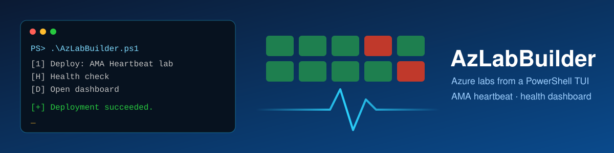
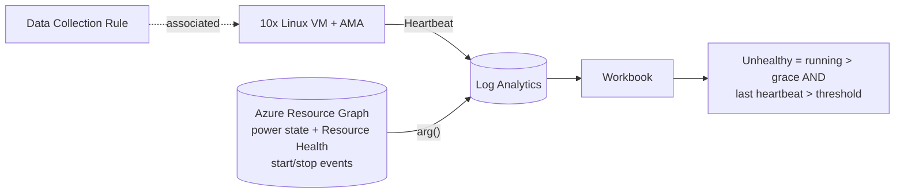

# AMA Heartbeats

This repo contains an Azure Monitor **workbook** that shows which running VMs have stopped sending Azure Monitor Agent (AMA) heartbeats. It's startup-aware, scales to 40,000 VMs, and needs **no additional data**. It also contains **AzLabBuilder**, a PowerShell TUI that deploys a lab to try the workbook out, including a simulated AMA outage.

## Deploy the dashboard only

[](https://portal.azure.com/#create/Microsoft.Template/uri/https%3A%2F%2Fraw.githubusercontent.com%2Fchrochma%2FAMAHeartbeats%2Fmain%2Fworkbook%2Fazuredeploy.json/createUIDefinitionUri/https%3A%2F%2Fraw.githubusercontent.com%2Fchrochma%2FAMAHeartbeats%2Fmain%2Fworkbook%2FcreateUiDefinition.json)

1. Select **Deploy to Azure**, then choose a subscription and resource group for the workbook.
2. Pick your **existing Log Analytics workspace** that receives the AMA heartbeats.
3. Select Create. Open it under **Azure Monitor > Workbooks**. You can switch the workspace later with the *Log Analytics workspace* parameter.

**Copy and paste instead:** in **Azure Monitor > Workbooks > New > Advanced Editor (`</>`) > Gallery Template**, paste the contents of [`workbook/workbook.json`](workbook/workbook.json) and select Apply. Then pick the workspace in the parameter bar. You can also paste [`workbook/azuredeploy.json`](workbook/azuredeploy.json) into **Deploy a custom template > Build your own template in the editor**.

**Data requirements:**
- **Log Analytics:** the workbook only reads the **`Heartbeat`** table. AMA writes it automatically to every workspace that is a destination of a DCR associated with the VM, whatever the DCR collects. A DCR that only collects a rare event, such as `Application!*[System[(EventID=11724)]]`, is therefore enough. This was validated against such a workspace with Windows VMs.
- **Azure Resource Graph (free):** power state, start events and 14 days of power history come from ARG via `arg("")`.
- **Scope:** Azure VMs (`microsoft.compute/virtualmachines`), both Windows and Linux. Arc servers aren't included.
- **Permissions for viewers:** *Reader* on the workspace, and *Reader* on the VMs so Resource Graph returns their power state.

To regenerate the three files after changing the KQL or layout, run [`workbook/Build-Workbook.ps1`](workbook/Build-Workbook.ps1).

---

# AzLabBuilder

A PowerShell console (TUI) tool for deploying ready-to-use Azure lab scenarios. It checks your Azure sign-in first, finds the cheapest VM size you can actually use, deploys the lab with one ARM deployment, and shows you the result.
## Features

- **Auth check:** if you already have an Az context, the tool tests that the token still works against ARM. You can then *continue*, *re-authenticate* or *switch subscription*. If there's no usable context, it asks you to sign in first. Device code sign-in is supported.
- **Cheapest usable SKU:** the tool lists x64, Gen2-capable SKUs in the region that aren't restricted for your subscription. It looks up the Linux pay-as-you-go price from the public Azure Retail Prices API and checks family and regional vCPU quota. The 5 cheapest usable SKUs are shown and #1 is the default.
- **Scenario registry:** to add a scenario, add one entry in `AzLabBuilder.ps1` and create a folder under `scenarios\`.
- **Stateless:** labs are found through the resource group tag `AzLabBuilderScenario`.

## Scenario 1 – AMA Heartbeat lab

| Component | Details |
|---|---|
| VMs | 10 (1–50) × cheapest usable SKU with ≥ 1 GB RAM, Ubuntu 22.04 Gen2, Standard HDD, **no public IP**, NSG without inbound rules. Default region: **Sweden Central** |
| Agent | Azure Monitor Agent (`AzureMonitorLinuxAgent`), system-assigned identity, automatic upgrade |
| Data | DCR → new Log Analytics workspace. Only critical syslog is collected, to keep ingestion cost low. AMA sends `Heartbeat` to every workspace set as a destination in an associated DCR |
| Dashboard | Azure Monitor **workbook** "AzLabBuilder - AMA Heartbeat Health" |

### Dashboard

The dashboard scales to **40,000 VMs**. Instead of listing every VM, it groups them into lines and boxes.

A running VM only counts as **unhealthy** after it has been up for longer than the **startup grace** period (default 10 min) **and** has sent no AMA heartbeat within the **threshold** (default 10 min). The VM's start time comes from Azure **Resource Health** start/allocate/restart events (or its creation time). A freshly started VM without a heartbeat shows as **Starting**, so a VM that is still booting doesn't cause noise.

| Box | Meaning |
|---|---|
| **Running** | VMs in the `running` power state |
| **Healthy** | Running, with an AMA heartbeat within the threshold |
| **Unhealthy** | Running for longer than the grace period, with **no AMA heartbeat for more than the threshold** |
| **Starting** | Started less than the grace period ago, with no heartbeat yet |
| **Deallocated** | VMs that are currently deallocated or stopped |
| **Health chart** | One line per group: **Running** (blue), **Healthy** (green), **Unhealthy** (red), **Deallocated** (gray) and Starting (purple). Buckets are the threshold size and widen for long ranges (max. about 300 points, e.g. 34 min for 7 days) |
| **Unhealthy VMs** (tiles) | Top 100 unhealthy VMs, longest silent first |
| **Groups** table | Per subscription and resource group: Total, Running, Healthy, Unhealthy, Unhealthy %, Starting, Deallocated. The worst groups are listed first |
| Not-healthy grid | Unhealthy and starting VMs (max. 5,000), with last boot and last heartbeat |

Workbook parameters:
- `Log Analytics workspace` (picker; standalone deployment: the selected workspace)
- `Subscription` (default: the lab subscription, `*` for the standalone workbook; `*` = all subscriptions visible to you)
- `Heartbeat threshold (min)`
- `Startup grace (min)`
- `Resource group` (default: the lab RG, `*` for the standalone workbook; `*` = all)
- `Chart time range` (1 h to 14 days)

**No extra data is collected.** Power state, start events and power history come from Azure Resource Graph (`Resources`, `healthresources`, `healthresourcechanges`, `resourcechanges`), which is free and holds 14 days of history. Log Analytics reads them through `arg("")`, and the only table used is the `Heartbeat` table that AMA writes anyway. The workspace must receive heartbeats from every VM in scope.

**How it scales.** `arg("")` transfers at most 1,000 rows, so no query pulls one row per VM out of Resource Graph:
- **Current state:** all VMs are packed into a few list rows inside Resource Graph and expanded in Log Analytics.
- **Chart:** power-state changes from `resourcechanges` are replayed backwards from the current running count, so there's no VM × time grid. Healthy per bucket is the distinct count of VMs with a heartbeat, capped at Running.

In a test with about 22,000 VMs, each box loaded in about 8 s, a 24 h chart in about 11 s, and a 7-day chart in about 18 s.

## Usage

```powershell
cd AMAHeartbeats
.\AzLabBuilder.ps1                          # interactive browser sign-in if needed
.\AzLabBuilder.ps1 -UseDeviceAuthentication # device code sign-in
```

| Key | Action |
|---|---|
| `1` | Deploy the AMA Heartbeat lab. Prompts for region, RG, VM count, prefix and threshold, then the SKU, then a plan and cost estimate before anything is deployed |
| `H` | Health check in the console, using the same startup-aware logic as the dashboard (Healthy / Unhealthy / Starting / Deallocated). For large scopes it lists only the first 50 VMs that need attention. Optional watch mode refreshes every 60 s; press `Q` to stop |
| `C` | **Simulate an AMA outage.** Asks on how many running VMs, picks them at random and blocks their outbound traffic to the `AzureMonitor` service tag with one NSG deny rule (`AzLabBuilder-AmaCrash`). The VMs keep running but their heartbeats stop, so they turn **Unhealthy** on the dashboard. `R` in the same screen removes the rule and restores all VMs |
| `D` | Open the workbook in the Azure portal |
| `R` | Delete a lab. You must type the RG name to confirm |
| `A` | Re-authenticate or switch subscription |

### Simulating an AMA outage

The outage simulation uses the lab's subnet NSG instead of stopping the agent inside the VM. That makes it fast to start and stop (one NSG update, no Run Command and no guest access), and the VM itself stays healthy. In a test:
- Heartbeats stopped about **2 min** after the rule was set, so a VM turns Unhealthy after about 2 min + the threshold.
- Heartbeats resumed about **2–5 min** after the rule was removed.
- Missed heartbeats are **not** backfilled, so the outage stays visible in the chart.

Blocked VMs are tracked by their private IP in the rule, so the tool always shows the current state. If a blocked VM is deallocated and gets a new IP, restore with `R`.

## Requirements

- PowerShell 7+ (recommended) or Windows PowerShell 5.1
- Az modules: `Az.Accounts`, `Az.Resources`, `Az.Compute`, `Az.OperationalInsights`. If any are missing, the tool offers to install them
- **Contributor** on the target subscription (or RG), plus permission to register the resource providers Compute, Network, OperationalInsights and Insights
- vCPU quota for 10 VMs of the selected family. The SKU list shows free family cores

## Notes

- The first heartbeats arrive about 5–10 minutes after the agent is installed. VMs show as **Starting** during the grace period; if the agent takes longer than that, they show as **Unhealthy** until the first heartbeat arrives.
- The VMs have no public IP. The subnet uses `defaultOutboundAccess: true`, so AMA can still reach Azure Monitor. That's fine for a lab, but use NAT Gateway or Firewall in production.
- The admin user is `labadmin`. A random password is generated and can be shown once after deployment. To access a VM, use Serial Console or Bastion.
- Cost: compute costs about 2.3 USD per day for 10 × `Standard_B2ats_v2` in Sweden Central, plus disks and minimal log ingestion. Remove the lab with `R` when you're done.
- The `arg("")` cross-service query in Log Analytics is in preview.
- Chart limitations: a VM deleted while running, with no power-off event, counts as off from its last power change. Running counts before VMs were created or deleted are approximate.

## Structure

```text
AMAHeartbeats/
├── AzLabBuilder.ps1                 # entry point, main menu, scenario registry
├── lib/
│   ├── Tui.ps1                      # console UI helpers
│   ├── Auth.ps1                     # module check, context validation, sign-in
│   └── Azure.ps1                    # SKU/price/quota selection, providers, password
├── scenarios/AmaHeartbeat/
│   ├── AmaHeartbeat.ps1             # deploy, workbook, health check, outage sim, remove
│   └── main.json                    # ARM template (VMs, AMA, DCR, LAW, workbook)
└── workbook/
    ├── Build-Workbook.ps1           # generates the three files below from AmaHeartbeat.ps1
    ├── azuredeploy.json             # ARM template: workbook only, existing workspace
    ├── createUiDefinition.json      # portal UI with workspace picker (Deploy to Azure)
    └── workbook.json                # gallery template for copy & paste
```
