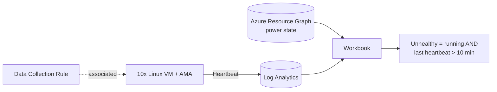

# AzLabBuilder

A PowerShell console (TUI) tool for deploying ready-to-use Azure lab scenarios. It checks your Azure sign-in first, finds the cheapest VM size you can actually use, deploys the lab with one ARM deployment, and shows you the result.

## Features

- **Auth check:** if you already have an Az context, the tool tests that the token still works against ARM. You can then *continue*, *re-authenticate* or *switch subscription*. If there's no usable context, it asks you to sign in first. Device code sign-in is supported.
- **Cheapest usable SKU:** the tool lists x64, Gen2-capable SKUs in the region that aren't restricted for your subscription. It looks up the Linux pay-as-you-go price from the public Azure Retail Prices API and checks family and regional vCPU quota. The 5 cheapest usable SKUs are shown and #1 is the default.
- **Scenario registry:** to add a scenario, add one entry in `AzLabBuilder.ps1` and create a folder under `scenarios\`.
- **Stateless:** labs are found through the resource group tag `AzLabBuilderScenario`.

## Scenario 1 – AMA Heartbeat lab

| Component | Details |
|---|---|
| VMs | 10 (1–50) × cheapest usable SKU with ≥ 1 GB RAM, Ubuntu 22.04 Gen2, Standard HDD, **no public IP**, NSG without inbound rules. Default region: **Sweden Central** |
| Agent | Azure Monitor Agent (`AzureMonitorLinuxAgent`), system-assigned identity, automatic upgrade |
| Data | DCR → new Log Analytics workspace. Only critical syslog is collected, to keep ingestion cost low. AMA sends `Heartbeat` to every workspace set as a destination in an associated DCR |
| Dashboard | Azure Monitor **workbook** "AzLabBuilder - AMA Heartbeat Health" |

### Dashboard

| Box | Source | Meaning |
|---|---|---|
| **Overall VMs in running state** | Azure Resource Graph | Count of VMs with power state `running`, out of all VMs in scope |
| **Healthy** | Log Analytics + `arg("")` | Running VMs with an AMA heartbeat within the threshold |
| **Unhealthy** | Log Analytics + `arg("")` | Running VMs with **no AMA heartbeat for more than 10 minutes** |
| **Unhealthy VMs** (tiles) | same | One red tile **per VM name**, showing the minutes since its last heartbeat (or "no heartbeat in 24h") |
| Detail table | same | Every running VM with its health, size, last heartbeat and minutes since |

Stopped or deallocated VMs are **ignored**. The workbook has two parameters: `Heartbeat threshold (min)` (default 10) and `Resource group` (default: the lab RG; `*` = the whole subscription).



## Usage

```powershell
cd AIApps\AzLabBuilder
.\AzLabBuilder.ps1                          # interactive browser sign-in if needed
.\AzLabBuilder.ps1 -UseDeviceAuthentication # device code sign-in
```

| Key | Action |
|---|---|
| `1` | Deploy the AMA Heartbeat lab. Prompts for region, RG, VM count, prefix and threshold, then the SKU, then a plan and cost estimate before anything is deployed |
| `H` | Health check in the console: power state + last AMA heartbeat. Optional watch mode refreshes every 60 s; press `Q` to stop |
| `D` | Open the workbook in the Azure portal |
| `R` | Delete a lab. You must type the RG name to confirm |
| `A` | Re-authenticate or switch subscription |

## Requirements

- PowerShell 7+ (recommended) or Windows PowerShell 5.1
- Az modules: `Az.Accounts`, `Az.Resources`, `Az.Compute`, `Az.OperationalInsights`. If any are missing, the tool offers to install them
- **Contributor** on the target subscription (or RG), plus permission to register the resource providers Compute, Network, OperationalInsights and Insights
- vCPU quota for 10 VMs of the selected family. The SKU list shows free family cores

## Notes

- The first heartbeats arrive about 5–10 minutes after the agent is installed. Until then, every VM shows as **Unhealthy**.
- The VMs have no public IP. The subnet uses `defaultOutboundAccess: true`, so AMA can still reach Azure Monitor. That's fine for a lab, but use NAT Gateway or Firewall in production.
- The admin user is `labadmin`. A random password is generated and can be shown once after deployment. To access a VM, use Serial Console or Bastion.
- Cost: compute costs about 2.3 USD per day for 10 × `Standard_B2ats_v2` in Sweden Central, plus disks and minimal log ingestion. Remove the lab with `R` when you're done.
- The `arg("")` cross-service query in Log Analytics is in preview. It doesn't support `mv-expand`, so each count box uses its own single-row query.

## Structure

```text
AzLabBuilder/
├── AzLabBuilder.ps1                 # entry point, main menu, scenario registry
├── lib/
│   ├── Tui.ps1                      # console UI helpers
│   ├── Auth.ps1                     # module check, context validation, sign-in
│   └── Azure.ps1                    # SKU/price/quota selection, providers, password
└── scenarios/AmaHeartbeat/
    ├── AmaHeartbeat.ps1             # deploy, workbook builder, health check, remove
    └── main.json                    # ARM template (VMs, AMA, DCR, LAW, workbook)
```
